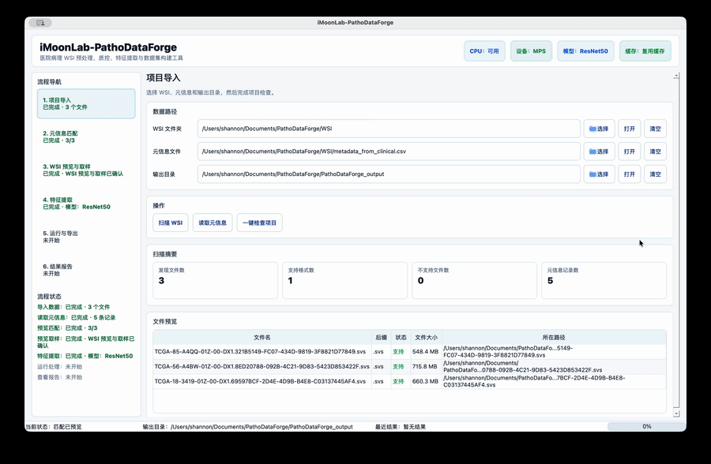

# iMoonLab-PathoDataForge

iMoonLab-PathoDataForge 是一个面向医院场景的病理全切片图像（WSI）预处理、质控、特征提取与脱敏数据整理工具。它可以扫描原始病理图文件，匹配临床 metadata，完成脱敏命名、组织区域检测、背景过滤、低质量 patch 过滤，并输出可交付给实验室继续建模的数据包。



上方动图展示 GUI 的核心工作流：项目导入、WSI 预览与取样、特征提取、运行导出和结果报告。

## 功能

- 扫描 `.svs`, `.tif`, `.tiff`, `.ndpi`, `.mrxs`, `.png`, `.jpg`, `.jpeg`
- 导入 `.csv` / `.xlsx` 临床标签表
- 根据病例 ID 或文件名匹配 WSI 与 metadata
- 输出 `metadata_cleaned.csv` 和本地 `mapping.csv`
- OpenSlide 优先读取真实 WSI；无 OpenSlide 时降级到 Pillow 读取普通图片
- 基于缩略图生成 tissue mask
- 按 tissue ratio、Laplacian blur score、brightness 过滤 patch
- 提供 PySide6 GUI 和 CLI 批处理入口
- 输出坐标 `.npy/.csv` 和采样 overlay 可视化
- 自动特征提取：ResNet50、UNI、UNI2-h、CONCH、Virchow2
- 坐标和特征 `.npy` 支持断点续跑缓存
- 扫描 WSI 时会忽略 TCGA/GDC manifest、clinical、parcel 等伴随文件
- HMAC-SHA256 脱敏、多级 WSI 索引、checksum 校验和私有映射表分离

## 安装

```bash
python -m venv .venv
source .venv/bin/activate
pip install -r requirements.txt
```

真实 `.svs` / `.ndpi` 等 WSI 通常需要系统安装 OpenSlide。macOS 可使用 `brew install openslide`，Windows 可安装 OpenSlide binaries 并把 bin 目录加入 PATH。没有 OpenSlide 时，demo 的 PNG/TIFF 流程仍可运行。

CONCH 特征提取需要额外安装官方仓库：

```bash
pip install git+https://github.com/Mahmoodlab/CONCH.git
```

## 生成 Demo 数据

```bash
python scripts/generate_demo_data.py
```

该命令会生成：

- `demo_data/wsi/`：模拟病理图 PNG/TIFF
- `demo_data/metadata.csv`：病例标签表
- `configs/demo.yaml`：可直接运行的 demo 配置

## 测试数据说明

本项目不随仓库分发真实 WSI、患者信息或 TCGA 原始数据。开发过程中使用过从 TCGA/GDC 下载的公开病理 WSI 进行本地流程验证，但这些文件体积很大且不应进入 GitHub 仓库，已通过 `.gitignore` 忽略 `WSI/`、输出目录和相关中间产物。

如果需要复现实测流程，可以自行从 TCGA/GDC 下载 `.svs` 文件、clinical cart 和 manifest，并在 GUI 中选择本地 `WSI/` 文件夹。软件扫描时会自动忽略 GDC manifest、clinical JSON/CSV、parcel、txt 等伴随文件，只处理真正的病理图像文件。

## GUI 启动

```bash
python main.py
```

在 GUI 中选择 WSI 文件夹、metadata 文件和输出目录后，软件会自动扫描、读取字段并尝试完成元信息匹配。处理过程在后台线程运行，日志和进度会实时显示。

GUI 现在按正式工作台组织为“项目导入 / 元信息匹配 / WSI 预览与取样 / 特征提取 / 运行与导出 / 结果报告”：

- “项目导入”页扫描 WSI、读取元信息，并预览输入文件。
- “元信息匹配”页显示自动匹配结果，也可手动调整病例 ID、标签、可选文件名字段和自定义病例 ID 正则。
- “WSI 预览与取样”页以切片浏览为主，支持滚轮缩放、鼠标拖动移动、绿色画笔标注，并只保留 patch 尺度、采样模式和最小前景比例等必要取样参数；放大时会重新读取当前 SVS 视野区域，而不是放大缩略图。
- “特征提取”页为固定步骤，默认启用 ResNet50，可选择模型、运行设备、批大小、CPU/GPU 工作进程、队列大小和目标文件；质控和高级输出参数也集中在这里。
- “运行与导出”页启动流程，显示进度、日志、结果摘要、输出路径和采样预览图。
- “结果报告”页汇总输出文件、patch 统计、标签数量、质量指标，并可生成不含 `mapping.csv` 的脱敏数据交付包，也可生成多维脱敏索引。

## CLI 启动

使用 demo 配置：

```bash
python -m pathodataforge.cli --config configs/demo.yaml
```

也可以使用默认配置：

```bash
python -m pathodataforge.cli --config configs/default.yaml
```

`configs/default.yaml` 保留 PRD 中的空输入模板。若已经运行过 demo 生成脚本，CLI 会在默认输入为空时自动使用 `demo_data/wsi` 和 `demo_data/metadata.csv`。

## 技术实现细节

iMoonLab-PathoDataForge 将 GUI、WSI 读取、patch 采样、特征提取和脱敏索引拆分为相对独立的模块，GUI 只负责参数输入、状态展示和后台任务调度，核心处理逻辑仍由 pipeline 执行，便于后续接入医院本地系统或实验室批处理流程。

- 桌面端使用 PySide6 构建，主窗口采用统一 `AppState` 管理 WSI 路径、metadata、字段映射、参数、硬件状态、运行状态和输出文件。
- WSI 读取优先使用 OpenSlide，支持 `.svs`、`.ndpi`、`.mrxs`、`.tif/.tiff` 等常见病理图格式；普通 PNG/JPEG/TIFF 可降级到 Pillow 读取，便于 demo 和轻量验证。
- WSI 预览支持缩略图浏览、鼠标滚轮缩放、拖拽平移和医生绿色画笔标注；放大时会重新读取当前视野区域，避免直接放大缩略图导致模糊。
- 背景过滤在缩略图上生成 tissue mask，再把候选 patch 映射回 level 0 坐标；dense 模式输出去背景后的全部无重叠组织候选，随机采样则从这些候选中抽样。
- patch 坐标以 level 0 的 `[x0, y0, x1, y1]` 范围为主格式，同时输出中心点字段，方便后续 MIL、空间可视化和病理区域回溯。
- 特征提取默认提供 ResNet50 baseline，预留 UNI、UNI2-h、CONCH、Virchow2 等病理 foundation model 接口；特征 `.npy` 与坐标 `.npy` 一一对应，并支持缓存复用。
- 运行流程采用后台 worker，GUI 日志和进度实时刷新，避免大图处理期间界面冻结。
- 多维脱敏索引使用 HMAC-SHA256 生成稳定匿名 ID，并将公开 manifest 与医院本地私有映射表分离，支持患者、病例、样本、蜡块、切片、WSI、patch 和医生标注的多层级对齐。

## 输出目录

默认输出到 `PathoDataForge_output/`：

```text
PathoDataForge_output/
├── features/
│   └── *_fts.npy
├── patches/
│   └── ...
├── metadata/
│   ├── coordinates/
│   │   ├── *_coors.npy
│   │   └── *_coors.csv
│   ├── metadata_cleaned.csv
│   ├── mapping.csv
│   └── patch_manifest.csv
├── logs/
│   └── processing.log
├── configs/
│   └── used_config.yaml
├── reports/
    ├── annotations/
    │   ├── *_doctor_annotations.json
    │   └── *_doctor_annotations.png
    ├── overlays/
    │   └── *_sampled_overlay.jpg
    └── summary.json
└── privacy_index/
    ├── anonymized_wsi/
    ├── manifests/
    │   └── manifest.csv
    ├── mappings_private/
    │   └── private_id_mapping.csv
    └── logs/
        └── privacy_index_run.json
```

`mapping.csv` 仅保存在本地输出目录，用于追溯原始文件名与脱敏文件名的对应关系，不建议随训练数据一起外发。

GUI 的“生成脱敏数据包”会在 `PathoDataForge_output/deliverables/` 下生成可交付文件夹，包含脱敏 metadata、patch manifest、patch 图像、坐标、特征、summary、采样预览图和医生标注；默认不包含 `mapping.csv`。

GUI 的“生成多维脱敏索引”会在 `PathoDataForge_output/privacy_index/` 下生成公开 manifest 和医院本地私有映射表。公开 manifest 可随匿名数据交付，`private_id_mapping.csv` 和本机密钥只能留在医院本地授权环境。

`privacy_index/mappings_private/private_id_mapping.csv` 包含真实 ID 到匿名 ID 的映射，只能保存在医院本地授权环境中，不应外发或提交到 GitHub。项目 `.gitignore` 已保护 `PRD.md`、`ID.md`、`WSI/`、输出目录、`test/synthetic_processed/`、私有映射表、密钥、模型权重和日志文件。

## 多维脱敏索引

`pathodataforge/privacy_index/` 模块用于病理数据脱敏与多维索引管理，目标是把医院日常积累的 WSI、临床 metadata、医生标注和后续 patch/feature 产物整理成可追踪、可质控、可交付的数据结构。

### GUI 使用流程

1. 在“项目导入”页选择 WSI 文件夹、metadata 文件和输出目录。
2. 在“元信息匹配”页确认病例 ID、标签、可选文件名字段的匹配结果。
3. 可选：在“WSI 预览与取样”页浏览切片，并用绿色画笔保存医生关注区域标注。
4. 完成处理后进入“结果报告”页，点击“生成多维脱敏索引”。
5. 系统会自动创建或复用本机医院密钥，生成稳定匿名 ID。医生无需手动输入密钥。

### 密钥管理

GUI 首次生成索引时会在当前系统用户目录下创建本机密钥：

```text
~/.pathodataforge/deid_secret.key
```

同一密钥可以保证同一真实患者 ID 在多次数据整理中得到稳定的 `patient_uid`，便于长期随访和增量扩充数据集。该密钥不写入输出 manifest，不进入交付包，不应提交到 GitHub。建议由医院信息科或项目负责人备份和权限管理。

命令行或程序化调用也可以显式传入 secret key，或通过环境变量提供：

```bash
export PATHOLOGY_DEID_SECRET_KEY="your-hospital-local-secret"
```

### 索引层级

manifest 会构建下列多级索引：

- `pseudo_patient_uid = HMAC_SHA256(医院本地脱敏密钥, real_patient_id)`
- 每个 WSI 生成 SHA256 checksum，用于完整性校验、去重和版本追踪
- manifest 构建 `patient_uid → case_uid → specimen_uid → block_uid → slide_uid → wsi_uid → patch_uid → annotation_uid`
- 公开 manifest 不包含姓名、身份证、手机号、出生日期、真实患者 ID、医院原始 ID 等敏感字段
- 年龄会泛化为年龄段，扫描日期只保留到月份

### 输出文件

```text
privacy_index/
├── anonymized_wsi/
│   └── WSI_<checksum>.svs
├── manifests/
│   └── manifest.csv
├── mappings_private/
│   └── private_id_mapping.csv
└── logs/
    └── privacy_index_run.json
```

`manifest.csv` 是可交付文件，包含匿名 ID、匿名 WSI 路径、文件格式、checksum、诊断、标签、部位、染色类型、年龄段、扫描月份和标注引用等字段。`private_id_mapping.csv` 是医院本地追溯表，包含真实患者 ID、病例 ID、病理号和匿名 ID 的对应关系，不能外发。

## Patch Manifest 字段

`metadata/patch_manifest.csv` 包含：

- `patch_path`
- `case_id`
- `slide_id`
- `label`
- `x`
- `y`
- `x0_level0`
- `y0_level0`
- `x1_level0`
- `y1_level0`
- `x_center_level0`
- `y_center_level0`
- `coordinate_format`
- `level`
- `patch_size`
- `tissue_ratio`
- `blur_score`
- `mean_brightness`
- `keep`
- `discard_reason`

仅 `keep=True` 的 patch 会保存为 PNG 文件。

## 背景/组织过滤

当前实现先在去背景后的组织区域上生成候选，再进行 patch 质量过滤：

1. 缩略图组织 mask：读取低分辨率 thumbnail，RGB 转 HSV，用 saturation 阈值和 Otsu saturation mask 找出有染色区域，同时用 value 阈值过滤接近白色的背景，并通过 morphology open/close 去噪和补洞。
2. 组织候选采样：密集采样使用无重叠网格，且候选 patch 必须满足最小前景比例；dense 模式输出全部组织候选 patch，不受随机/优选 patch 数限制；随机采样从这些组织候选 patch 中随机选择。
3. patch 质量过滤：对候选 patch 计算 `tissue_ratio`、灰度图 Laplacian variance 作为 `blur_score`、以及 `mean_brightness`。低组织占比、过模糊、过亮或过暗的 patch 会在 manifest 中标记为 `keep=False`。

## 坐标格式

坐标缓存保存在 `metadata/coordinates/*_coors.npy`，格式为 `N x 4` 的 int64 数组：

```text
[x0_level0, y0_level0, x1_level0, y1_level0]
```

也就是说，主格式是 **patch 范围**，且全部使用 WSI level 0 坐标。中心点同时写入 `*_coors.csv` 和 `patch_manifest.csv`：

```text
x_center_level0 = (x0_level0 + x1_level0) / 2
y_center_level0 = (y0_level0 + y1_level0) / 2
```

选择范围作为主格式，是因为它完整描述 patch 边界；中心点可以从范围稳定推导出来。

## 特征提取模型

在配置中启用：

```yaml
features:
  enable: true
  model_name: ResNet50   # ResNet50 / UNI / UNI2-h / CONCH / Virchow2
  batch_size: 32
  device: auto           # auto / cpu / cuda:0
  precision: auto
  overwrite: false
```

GPU 检测结果会写入日志和 `summary.json`。如果没有 CUDA GPU，程序会优先尝试 Apple MPS，再回退 CPU。UNI2-h、Virchow2 这类大模型在 CPU 上会非常慢。

ResNet50 使用 torchvision ImageNet 预训练权重，不需要 Hugging Face 授权。发布版面向医院医生使用时，软件会以内置或本地随附模型的方式提供已支持模型，GUI 不要求医生输入 Hugging Face token。开发者如需测试 UNI、UNI2-h、CONCH、Virchow2 等受条款约束模型，请先在模型来源页面完成授权，并在开发环境中准备本地模型缓存。

模型来源：

- ResNet50: `torchvision.models.resnet50`
- UNI: `MahmoodLab/UNI`
- UNI2-h: `MahmoodLab/UNI2-h`
- CONCH: `MahmoodLab/CONCH`
- Virchow2: `paige-ai/Virchow2`

ResNet50 使用 `torchvision` 加载。UNI、UNI2-h、Virchow2 使用 `timm` 从 Hugging Face 加载。CONCH 使用 MahmoodLab 的 CONCH 包加载。

特征输出到 `features/*_fts.npy`。每个 `.npy` 的第 0 维与对应 `*_coors.npy` 的坐标行一一对应。若 `.npy` 已存在且可读取、行数匹配，程序会直接复用缓存；损坏的 `.npy` 会重命名为 `.broken` 并重新计算。

## 注意事项

- patch 提取按窗口逐块读取，不会一次性把整张 WSI 载入内存。
- 真实 WSI 的倍率选择会优先读取 OpenSlide objective power；普通图片 fallback 默认按 40x 基准估算。
- dense 模式会输出全部组织候选 patch；`max_patches_per_slide` 只限制 `random_tissue` 和 `top_quality` 模式。
- 未匹配 metadata 的 WSI 会保留在 `metadata_cleaned.csv` 中，状态为 `unmatched`，标签为空。
